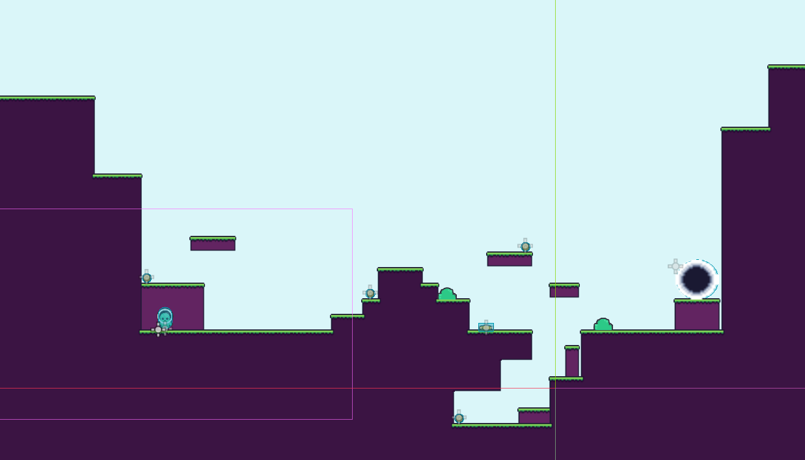

## Fonctionalité extra
Mon idée était d'ajouter des bonus tout au long du jeu  pour améliorer mon jeu du dernier TP donc, j'allais agrandir les niveaux pour pouvoir intégrer des objets un peu partout. Par exemple, si le personnage récolte un objet, celui-ci va plus vite pendant quelques secondes ou une pièce indique la pièce à recolter la plus proche.


## Plus
Comme mentionné plus haut, je vais agrandir les maps en ajountant des trucs plus interactifs dedans et en ajoutant des signes plus claires que nous nous rapprochons de la fin du jeu avec des pièces de navette ou des éléments spaciaux. Je vais aussi faire une scène de fin pur célébrer que l'alien est retourner chez lui et arranger mon menu ingame.


# Résultat final

## Arborescence

Script globale des mes areas, j'ai utilisé la fonction "Nouvelle scène héritée" pour faire mes scènes Area alors mon script reste le même pour la plupart avec quelques additions dépendant des niveaux.
```
 ┖╴root
    ┠╴Gamemanager
    ┖╴AreaTemplate
       ┠╴ciel2
       ┠╴ciel
       ┠╴area_exit
       ┃  ┠╴Sprite2D
       ┃  ┖╴CollisionShape2D
       ┠╴TileMap
       ┃  ┠╴one_way_ground
       ┃  ┖╴ground
       ┠╴buisson_01
       ┠╴buisson_02
       ┠╴Area2D
       ┃  ┠╴Sprite2D
       ┃  ┠╴CollisionShape2D
       ┃  ┠╴AnimationPlayer
       ┃  ┖╴Label
       ┠╴player
       ┃  ┠╴Camera2D
       ┃  ┠╴playeranimateur
       ┃  ┃  ┠╴AnimationPlayer
       ┃  ┃  ┖╴Sprite2D
       ┃  ┖╴CollisionShape2D
       ┠╴Coins
       ┃  ┠╴Coin
       ┃  ┃  ┠╴Label
       ┃  ┃  ┠╴Sprite2D
       ┃  ┃  ┠╴CollisionShape2D
       ┃  ┃  ┖╴CoinSound
       ┃  ┠╴Coin2
       ┃  ┃  ┠╴Label
       ┃  ┃  ┠╴Sprite2D
       ┃  ┃  ┠╴CollisionShape2D
       ┃  ┃  ┖╴CoinSound
       ┃  ┠╴Coin3
       ┃  ┃  ┠╴Label
       ┃  ┃  ┠╴Sprite2D
       ┃  ┃  ┠╴CollisionShape2D
       ┃  ┃  ┖╴CoinSound
       ┃  ┖╴Coin4
       ┃     ┠╴Label
       ┃     ┠╴Sprite2D
       ┃     ┠╴CollisionShape2D
       ┃     ┖╴CoinSound
       ┠╴AudioStreamPlayer
       ┠╴CanvasLayer
       ┃  ┠╴Button4
       ┃  ┖╴VBoxContainer
       ┃     ┠╴Button
       ┃     ┠╴Button2
       ┃     ┖╴Button3
       ┖╴CanvasLayer2
          ┠╴ColorRect
          ┖╴HBoxContainer
             ┠╴CoinsIcon
             ┖╴CoinsLabel
```

## Vu globale des areas:


## Crédits
Images -

Interface : Kenney.nl

Fond : Pixabay

Sons -

Effets sonore : Pixabay

Musique de fond : Pixabay


